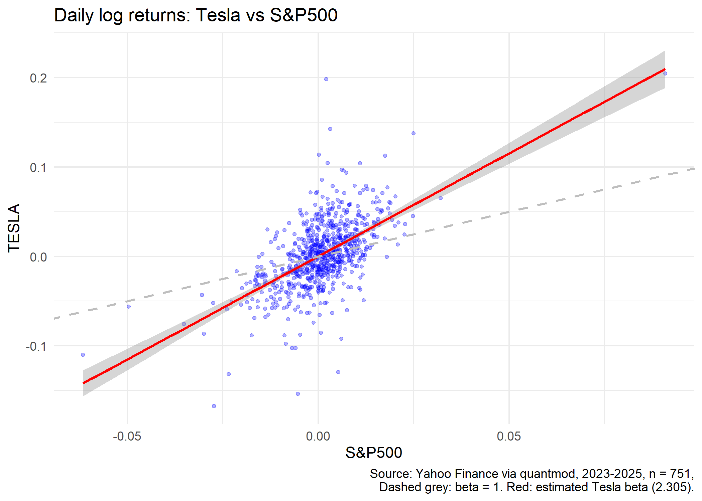

# Beta of Tesla relative to the S&P 500

The first part of the project estimates the beta of Tesla (TSLA) relative to the S&P 500 using daily log returns from 2023 to 2025. The analysis is done in R.

## Data

- Source: Yahoo Finance, downloaded with the `quantmod` package on 5 October 2026
- Period: January 2023 to December 2025
- Observations: 751 daily log returns, computed from adjusted close prices
- The first observation was removed because a return is not defined for it
- Data files (in data folder): `data/tesla_sp500.csv` and `data/tesla_sp500.rds`

The first column of the CSV file contains the date. The other two columns are the daily log returns of Tesla and the S&P 500.

## Method

Beta is estimated with a simple linear regression of Tesla returns on S&P 500 returns:

`tesla = alpha + beta * sp500 + error`

- `alpha` is the intercept: the average Tesla return on a day when the S&P 500 return is zero.
- `beta` is the slope: how much the Tesla return changes on average when the S&P 500 return changes by one unit.
- `error` is the part of the Tesla return that the market does not explain.

## Results

- Beta: 2.305 (standard error 0.118, 95% confidence interval 2.07 to 2.54)
- Alpha: 0.0001 (not statistically significant, p = 0.92)
- R-squared: 0.34

The dashed grey line has a slope of 1 (the market). The red line is the estimated regression line for Tesla.

## Conclusion

Tesla amplifies market movements: when the S&P 500 moves by 1%, Tesla moves by about 2.3% on average. However, the market explains only about one third of Tesla's daily variation, so most of its movement is specific to the company.
